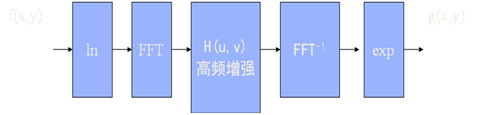
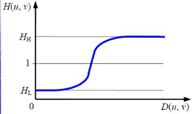

<h1>
《数字图像处理》上机实验
</h1>

## 一、几何变换

1.1
通过图像点的坐标几何对应关系实现图像的几何变化，包括平移，旋转，放大，缩小等。

1.2 主要使用到的函数：

imtransform

1.3 实验内容及步骤（选用图像1）

（1）利用matlab语言直接编程实现图像的平移；

（2）利用matlab语言直接编程实现图像的1/2倍缩放；

（3）利用matlab语言直接编程实现图像的2倍放大；

（4）利用Imtransform函数实现上述功能，并进行对比。

## 二、用空域和频域滤波器对图像进行增强

2.1 主要使用到的函数：imnoise，fspecial,
imfilter，fft2，fftshift，ifftshift，ordfilt2，medfilt2

2.2  实验内容及步骤：
<!-- -->
1.  对图片1添加高斯白噪声，其均值为0，方差为0.025；

2.  对上述图片进行均值滤波；

3.  对上述图片分别采用梯度算子、laplacian算子、sobel算子、prewitt算子对图像进行锐化；

4.  对上述图像进行傅立叶变换，观察其特点，如何进行频域低通和高通来看，‘’；‘’滤波；

5.  对图片1添加椒盐噪声，并尝试用最小值、最大值、中值滤波器进行空间滤波。

### 题目

1.  对图像2实现梯度倒数加权平均法，其模板信息如下
$$
W=\left[\begin{array}{lll}
w(x-1, y-1) & w(x-1, y) & w(x-1, y+1) \\
w(x, y-1) & w(x, y) & w(x, y+1) \\
w(x+1, y-1) & w(x+1, y) & w(x+1, y+1)
\end{array}\right].
$$
$$
w(x+i, y+j)=\frac{1}{2} \bullet \frac{g(x, y, i, j)}{\sum_i \sum_j g(x, y, i, j)}(i, j=-1,0,1 \text {, 且不同时为 } 0)
$$
$$
g(x, y, i, j)=\frac{1}{|f(x+i, y+j)-f(x, y)|}
$$
2.  对图像3实现同态滤波增强。

同态滤波思路如下：(滤波器参数自行设定)

1.  找出图4中所有正方形所在的位置

2.  去除图5中的噪声

3.  对图6进行伪彩色增强

4.  对图7根据图像特性，综合采用平滑滤波，一个微分算子，二阶微分算子，幂变换函数进行图像增强

## 实验报告要求：

1.实验目的，实验内容（每个实验提交实验处理结果，简述算法，分析结果，提交word文档）
